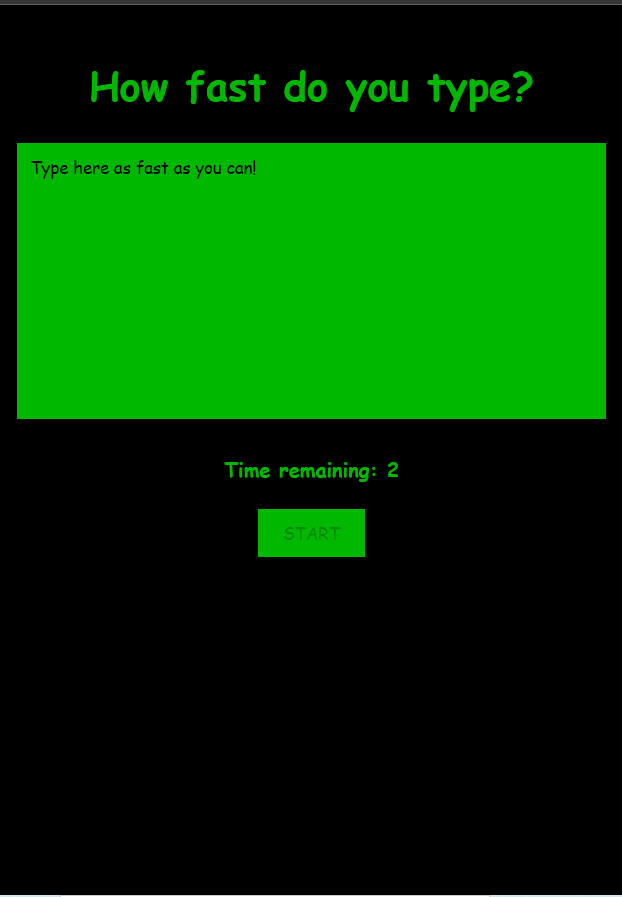
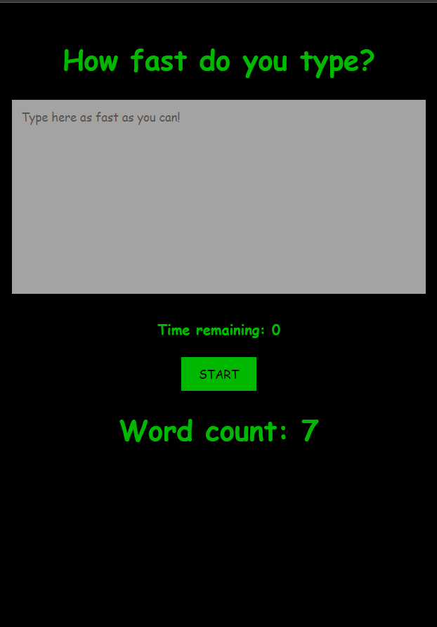

# Typing Game ⌨

<p align="center">

</p>


|  |  |
| :-----------------------------------------------: | :-----------------------------------------------: |

&nbsp;
&nbsp;

## Project Description

Website developed to be a litle game that gives a time to the user type in a textarea and when the timer gets to 0, count the amount of words on it (regardless of whether it is spelled correctly or not).

## How to run it locally

### Install

Clone this repository and install it dependencies with this command:

```
 npm install
```

### Running

Run the application with npm start command, it will start the app on localhost:3000:

```
 npm start
```

## :hammer: Project Functionalities

- `Functionality 1`: Set a timer 
- `Functionality 2`: Get words from textarea and count it
- `Functionality 3`: Disable button and textarea when the game is not running
- `Functionality 4`: Focus textarea after button 'start' is clicked

## ✔️ Technologies and techniques used

- `React`
- `Hooks (useState, useEffect, useRef)`
- `Clean code`